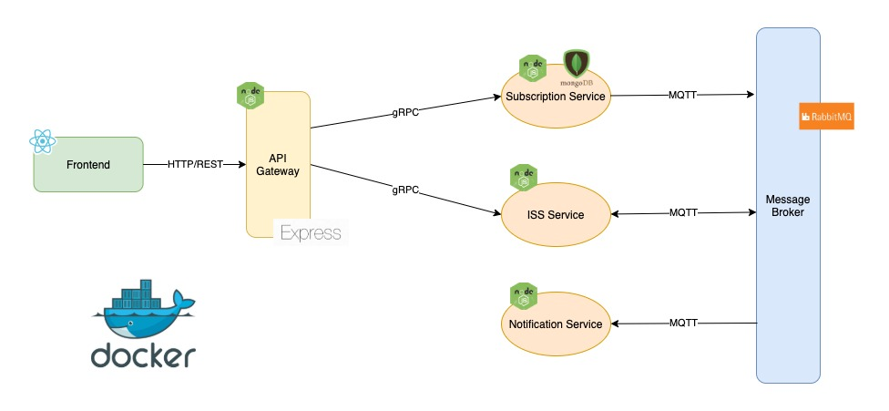
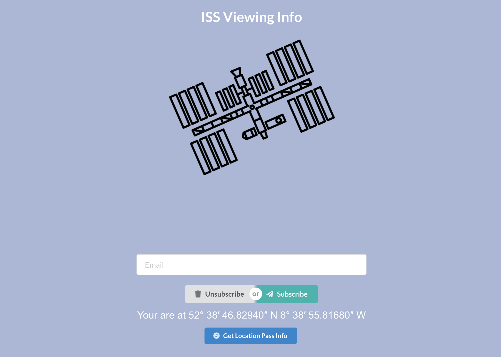
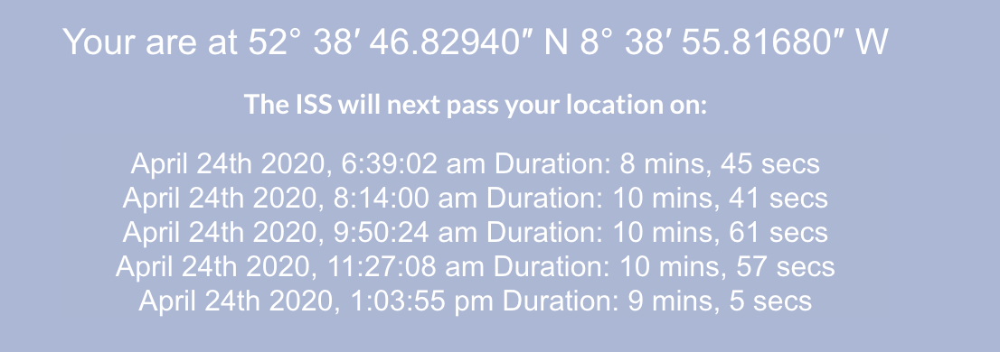

# ISS Notifier

An application which notifies users of the next viewings of the International Space Station in their area. Implemented in the microservices architecture, using Docker and docker-compose.

## Architecture

## Services

#### Frontend

A simple react frontend to demonstract the API. It allows users to subscribe/unsubscribe from notification emails. Requires geo-location to be enabled in the browser.

Also displays viewing information directly in the website.

Is accessible on http://localhost:3000

#### Subscription Service

A node microservice used for managing users subscriptions.
Requires a mongoDB instance to store subscription data.

Can be used to configure the frequency of notification emails. This is defaulted to 5 minutes for testing purposes. This can be overriden by setting an environment variable with a cron schedule expressions.

`SCHEDULE=* /5 * * *`

Publishes to the message broker when notification emails need to be sent.

#### ISS Service

A node microservice used for fetching ISS location data from the free API `http://open-notify.org/Open-Notify-API/` and exposes this information to the API Gateway.

Both subscribes and publishes to the message broker when new email notifications are needed.

1. Subscribes to messages from the subscription-service.
2. Fetches ISS info for each notification request received.
3. Publishes enriched data back to the message broker.

#### Notification Service

A node microservice used for creating an sending emails to subscribers.
Subscribes to notification messages from the iss-service.
Formats emails and sends them using smtp and a test Gmail account.

## How to run

#### NPM

All individual services and frontend can be run using:

`npm start`

This will require installing and running an instance of RabbitMQ and MongoDB.

#### Docker

Each service contains a Dockerfile and the project contains a docker-compose file which will orchestrate running all the services.

This can be started with:

`docker-compose up`

or rebuild containers:

`docker-compose build`

This will launch all services as well as other dependencies. These include:

- MongoDB
- RabbitMQ
- The Elastic Stack for log processing and monitoring (Kibana: http://localhost:5601)

### GitHub Repo

https://github.com/xianskel/iss-notifier
